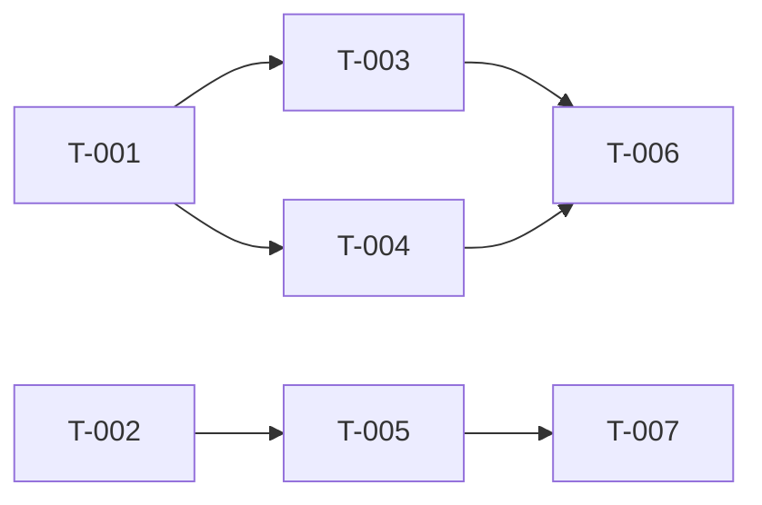

# Blueprint Architect — Generate Build Site

This is the second phase of Blueprint. You read blueprints and generate a build site — a dependency-ordered task graph that tells the builder what to build and in what order.

No domain plans. No file ownership. No time budgets. Just: tasks, what blueprint requirement they implement, and what blocks what.

## Step 0: Resolve Execution Profile

Before generating the site:

1. Run `"${CLAUDE_PLUGIN_ROOT}/scripts/bp-config.sh" summary` and print that exact line once.
2. Run `"${CLAUDE_PLUGIN_ROOT}/scripts/bp-config.sh" model reasoning` and treat the result as `REASONING_MODEL`.

Do NOT rely on the agent frontmatter model. Dispatch the actual site-generation work to a `bp:architect` subagent with `model: "{REASONING_MODEL}"`.

## Step 1: Validate Blueprints Exist

Check `context/blueprints/` for blueprint files. If none found, tell the user:
> No blueprints found. Run `/bp:draft` first.

If `--filter` is set, only include blueprints matching the filter pattern.

## Step 2: Read All Blueprints

1. Read `context/blueprints/blueprint-overview.md` if it exists (for dependency graph)
2. Read all `context/blueprints/blueprint-*.md` files (apply filter if set)
3. Catalog every requirement (R-numbered) with its acceptance criteria and dependencies
4. If `DESIGN.md` exists at project root, read it — note all design tokens and component patterns for use when decomposing UI requirements into tasks

## Step 3: Decompose Requirements into Tasks

Break each requirement into one or more implementable tasks:
- Simple requirements (1-2 acceptance criteria) → 1 task
- Complex requirements (3+ acceptance criteria, multiple concerns) → multiple tasks
- Each task should be completable in one loop iteration
- For UI tasks: include `**Design Ref:** DESIGN.md Section {N} — {section name}` in the task description to guide the builder on which design patterns apply

Use T-numbered task IDs (T-001, T-002, ...) across all domains.

## Step 4: Build Dependency Graph

For each task, determine what it's blocked by:
- Explicit dependencies from blueprint (R2 depends on R1)
- Implicit dependencies (can't test an API endpoint before the data model exists)
- Cross-domain dependencies (notifications depend on the events they notify about)

Organize tasks into tiers:
- **Tier 0**: tasks with no dependencies (start here)
- **Tier 1**: tasks that depend only on Tier 0 tasks
- **Tier 2**: tasks that depend on Tier 0 or Tier 1 tasks
- etc.

## Step 5: Write the Site

Create the `context/plans/` directory if it doesn't exist.

Dispatch a `bp:architect` subagent with `model: "{REASONING_MODEL}"` to produce the build-site contents from the blueprints and dependencies you cataloged above, then write the returned site to disk.

Write `context/plans/build-site.md`:

```markdown
---
created: "{CURRENT_DATE_UTC}"
last_edited: "{CURRENT_DATE_UTC}"
---

# Build Site

{Total tasks} tasks across {total tiers} tiers from {blueprint count} blueprints.

---

## Tier 0 — No Dependencies (Start Here)

| Task | Title | Blueprint | Requirement | Effort |
|------|-------|------|------------|--------|
| T-001 | {title} | blueprint-{domain}.md | R1 | {S/M/L} |
| T-002 | {title} | blueprint-{domain}.md | R1 | {S/M/L} |

---

## Tier 1 — Depends on Tier 0

| Task | Title | Blueprint | Requirement | blockedBy | Effort |
|------|-------|------|------------|-----------|--------|
| T-003 | {title} | blueprint-{domain}.md | R2 | T-001 | {S/M/L} |

---

## Tier 2 — Depends on Tier 1
...

---

## Summary

| Tier | Tasks | Effort |
|------|-------|--------|
| 0 | {n} | {breakdown} |
| 1 | {n} | {breakdown} |
| ... | | |

**Total: {n} tasks, {n} tiers**
```

If a site already exists, ask the user whether to overwrite or keep the existing one.

## Step 6: Dependency Graph

After the tier tables, add a **directed parallelization graph** using Mermaid syntax. This shows at a glance which tasks can run in parallel and what blocks what:

```markdown
## Dependency Graph


```

Rules for the graph:
- Every task appears as a node
- Arrows point from dependency → dependent (A --> B means "A must finish before B starts")
- Tasks with NO incoming arrows can run immediately (Tier 0)
- Tasks at the same depth with no edges between them can run in parallel
- Use `graph LR` (left-to-right) for readability
- Group by tier visually where possible

## Step 7: Report

```markdown
## Architect Report

### Blueprints Read: {count}
### Tasks Generated: {count}
### Tiers: {count}
### Tier 0 Tasks: {count} (can run in parallel immediately)

### Next Step
Run `/bp:build` to start implementation (auto-parallelizes independent tasks).
Run `/bp:build --peer-review` to add Codex review.
```

### Rules

- Every blueprint requirement MUST map to at least one task
- Tasks should be small — prefer M over XL
- Dependencies must be genuine blockers, not just ordering preferences
- The site is the ONLY planning artifact — no domain plans, no file ownership
- Update `last_edited` if modifying an existing site
